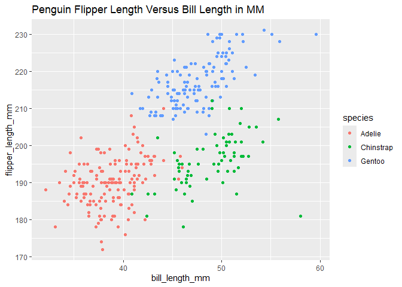

Penguin Analysis
================
Wayne Monical
2024-09-20

## Loading Data

Here we load the `tidyverse` package and the `penguins` data set from
the `palmerpenguins` package.

``` r
library(tidyverse)
```

    ## Warning: package 'tidyverse' was built under R version 4.4.2

    ## Warning: package 'ggplot2' was built under R version 4.4.2

    ## Warning: package 'dplyr' was built under R version 4.4.2

``` r
data("penguins", package = "palmerpenguins")
```

This data set comes in the form of a data frame. It contains data on
three different penguin `species`, Adelie, Gentoo, and Chinstrap. The
penguins range over three different islands, Torgersen, Biscoe, and
Dream, given by the `island` variable. Observations come over three
years, 2007 through 2009, given by the `year` variable.

The data describes 344 penguin individuals in a total of 8 variables.
The data includes various physical measures of the penguins, such as
their flipper length in millimeters, given by the `flipper_length_mm`
variable. This variable has an average value of 200.92 in this data set.

Here is a scatter plot of the `flipper_length_mm` and the
`bill_length_mm` variables, with a coloring according to the `species`
variable. This plot is saved in the file `penguins_flipper_vs_bill.png`.

``` r
ggplot(data = penguins, mapping = aes(x = bill_length_mm, y = flipper_length_mm, color = species)) + geom_point() + ggtitle('Penguin Flipper Length Versus Bill Length in MM')
```

    ## Warning: Removed 2 rows containing missing values or values outside the scale range
    ## (`geom_point()`).

<!-- -->

``` r
ggsave('penguins_flipper_vs_bill.png')
```

    ## Saving 7 x 5 in image

    ## Warning: Removed 2 rows containing missing values or values outside the scale range
    ## (`geom_point()`).

## Data Types and Penguin Types

I will create an example tibble data frame with `tidyverse`’s `tibble`
function. This example data frame will have four columns, one of each
data type of numeric, logical, character, and factor.

``` r
example_tbl = tibble(
  rand_samp = rnorm(10, mean = 0, sd = 1)
  , log_samp = rand_samp > 0
  , char_vec = c(rep("I", 3), rep('love', 3), rep('stats!', 4))
  , factor_vec = factor(char_vec)
)
```

I will attempt to take the mean of each column of the data frame. The
mean of the numeric data is as expected. The mean of the logical data
can be understood as the proportion of `TRUE` values, since R coerces
logical vectors into zeros and ones when evaluating them as numbers. The
character and factor vectors return `NA` values, since there is no way
to take the mean to these vectors.

``` r
example_tbl |> pull(rand_samp) |> mean()
```

    ## [1] -0.3013563

``` r
example_tbl |> pull(log_samp) |> mean()
```

    ## [1] 0.4

``` r
example_tbl |> pull(char_vec) |> mean()
```

    ## Warning in mean.default(pull(example_tbl, char_vec)): argument is not numeric
    ## or logical: returning NA

    ## [1] NA

``` r
example_tbl |> pull(factor_vec) |> mean()
```

    ## Warning in mean.default(pull(example_tbl, factor_vec)): argument is not numeric
    ## or logical: returning NA

    ## [1] NA

In the next code chunk, I apply the `as.numeric` function to the three
non-numeric vectors before taking their `mean`. Again, the logical
vector behaves well, turning `FALSE` and `TRUE` into zero and one.
Applying the function to the character vector introduces a missing
value, because there is no defined default way to turn a string of
characters into a number in base R. In my opinion, this is a good thing.
Finally, the factor vector successfully returns a mean, which is
unexpected, because it gave a missing value when I applied the `mean`
function without `as.numeric`.

Investigating further, I see that when `as.numeric` was applied to the
factor, it assigned a positive integer value to each factor level in the
order of appearance. The `mean` function could then be applied without
error. Interestingly, this did not happen in the previous example. Since
these two lines of code produced different results, we must conclude
that they are different, i.e. that R does not simply apply the
`as.numeric` function when taking the `mean`.

``` r
example_tbl |> pull(log_samp) |> as.numeric() |> mean()
example_tbl |> pull(char_vec) |> as.numeric() |> mean()
example_tbl |> pull(factor_vec) |> as.numeric() |> mean()
```

``` r
example_tbl |> pull(factor_vec) |> as.numeric()
```

    ##  [1] 1 1 1 2 2 2 3 3 3 3
